- Tạo project với dependencies: Jpa, Lombok, H2 database
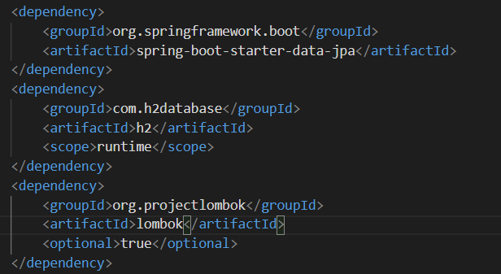
- Tạo file sql với 20 bản ghi bằng Mockaroo.com và cho vào resource
- Bổ sung cấu hình vào application.properties
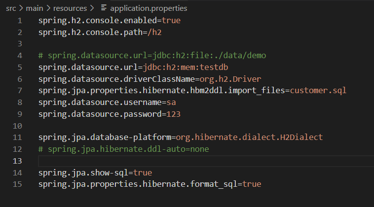
- Tạo entity với các trường: firstName,lastName, email, mobile, job.
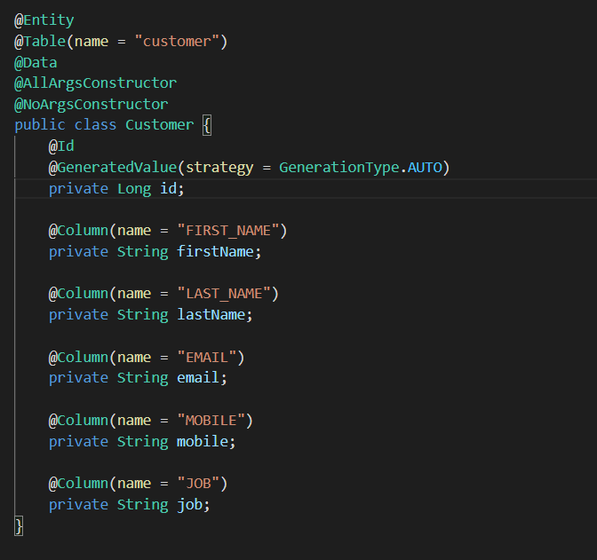
- Tạo file CustomerRepository extend CrudRepository
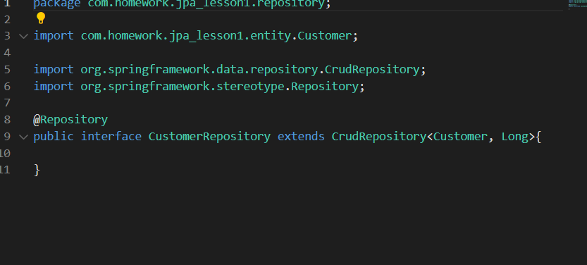
- Tạo interface service:
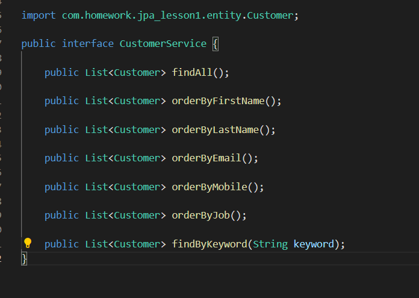
- Tạo service có các method theo yêu cầu đề bài :
    + findAll(), findByKeyword(String keyword), orderByEmail(), orderByFirstName,...
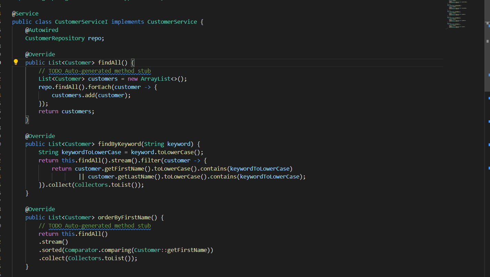
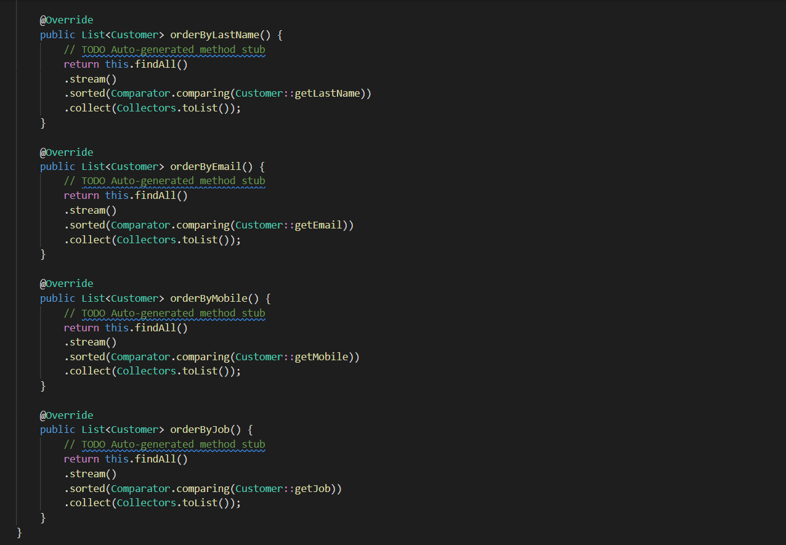
- Tại file Application: autowired service, sử dụng Logger để in ra terminal 
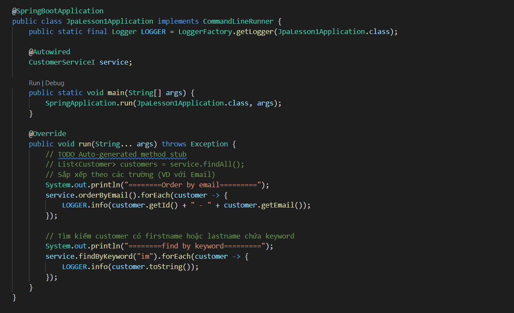
- Màn hình terminal sau khi gọi hàm sắp xếp theo email (các trường khác tương tự)
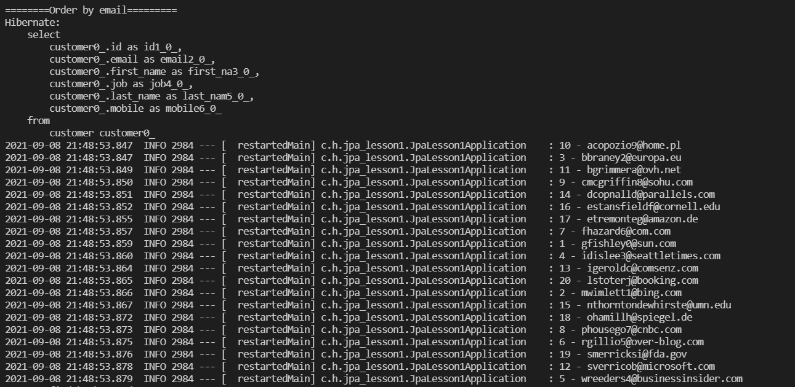
- Màn hình terminal sau khi gọi hàm findByKeyword:
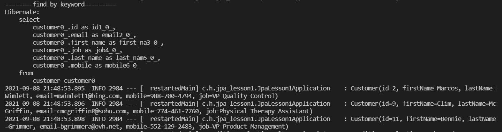
- Thực hiện các truy vấn , sắp xếp trên h2-console:
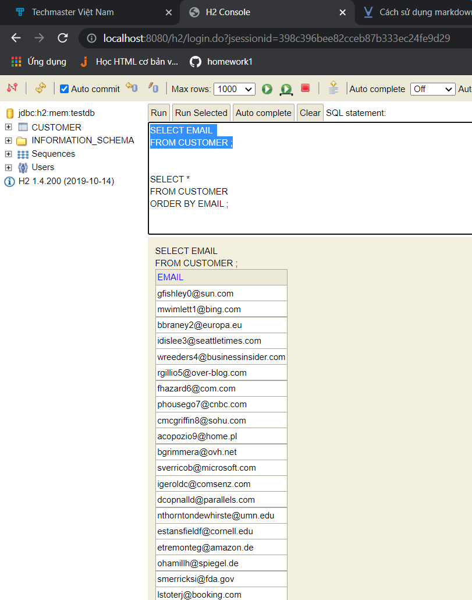
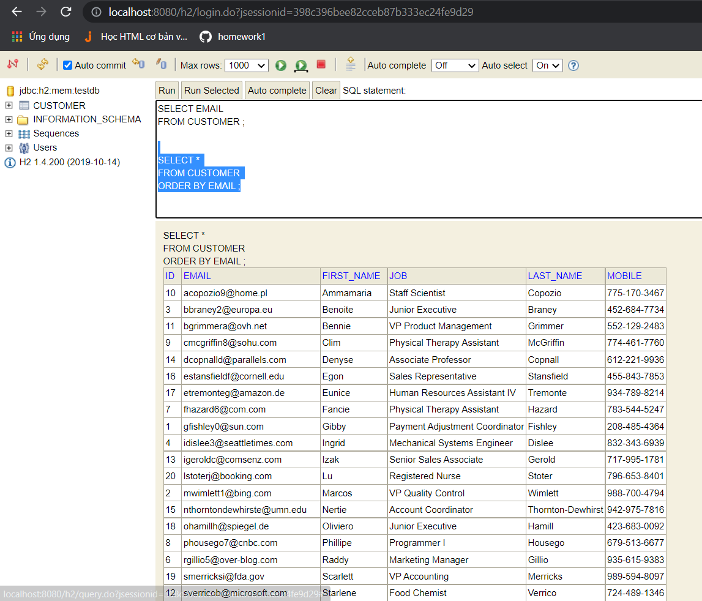