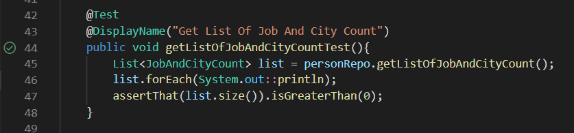

# Data JPA Test
1. Tạo project spring boot với dependencies : JPA, H2, AssertJ, Junit

    

2. Tạo data test "person.sql" và Entity "Person.java" với các trường tương ứng

    
    

3. Thực hiện truy vấn và unit test
    - Đếm số người theo từng công việc theo thứ tự giảm dần:
        + Tạo class JobCount với các trường tương ứng với các cột được trả về từ câu truy vấn:

            
        + Tạo interface PersonRepo extend JpaRepository và viết custom query:

            
        + Tạo file PersonTest.java trong package test để thực hiện unit test

            
    - Đếm top 5 công việc có nhiều người làm nhất: (sử dụng pageable để lấy 5 bản ghi đầu tiên)

        
        
    - Đếm số lượng người nhóm theo từng công việc và cùng thành phố:
        + Tạo class JobAndCityCount.java: 

            
        + Custom query và test

            
            
    - Đếm mức lương trung bình theo từng công việc thứ tự giảm dần:
        + Tạo class JobAverageSalary.java

            
        + Custom query và test

            
            
    - Đếm mức lương trung bình theo từng thành phố thứ tự giảm dần:
        + Tạo class CityAvgSalary.java

            
        + Custom query và test

            
            
    - Đếm 5 công việc nhiều nhất theo từng thành phố:
        + Sử dụng đối tượng JobAndCityCount; 
        + Custom query và test
        
            
            
