# Paging and sorting với spring boot và thymleaf
1. Tạo project với dependency: JPA, H2, Thymleaf, lombok,.... 
2. Sử dụng mockaroo để tạo file sql với 100 records
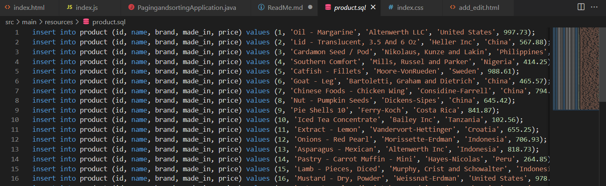
3. Tạo entity Product mapping với dữ liệu đã tạo
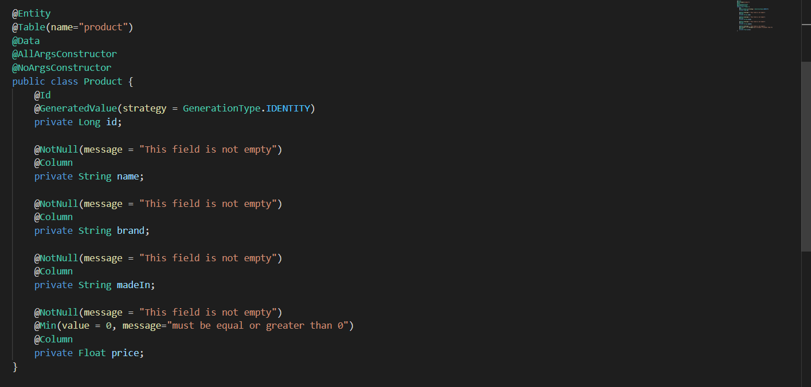
4. Tạo ProductRepository extend JpaRepository
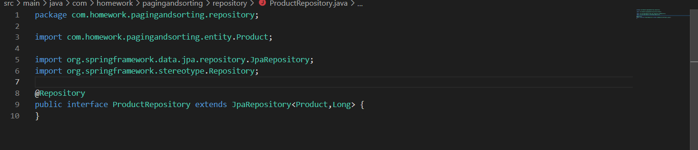
5. Tạo service sử dụng pagable để phân trang và sắp xếp theo các field với "order" là thứ tự sắp xếp (asc or desc)
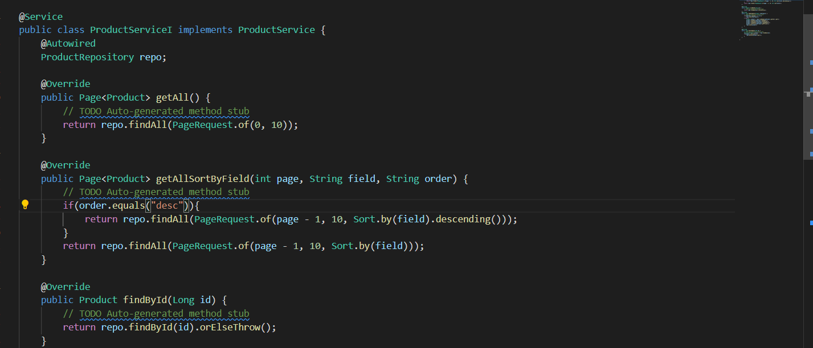
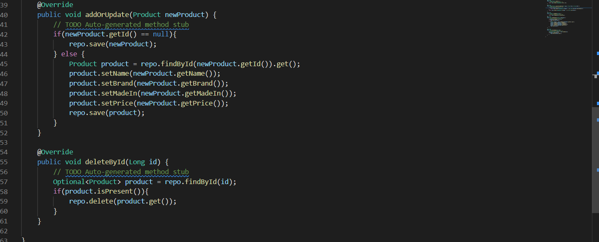
6. Tạo Controller
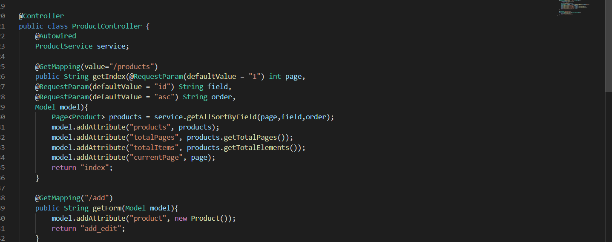
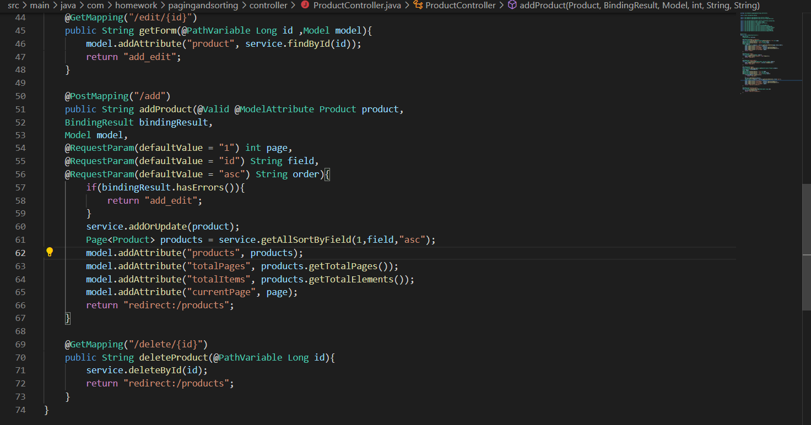
7. Tạo file 2 file html lần lượt là màn hình danh sách product và màn hình thêm/ sửa product
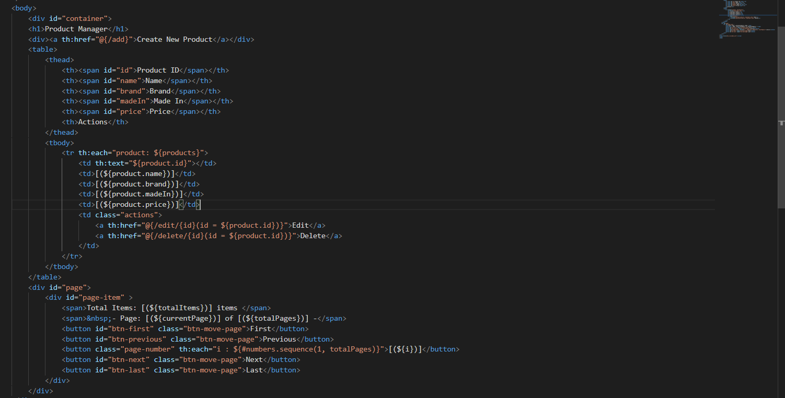
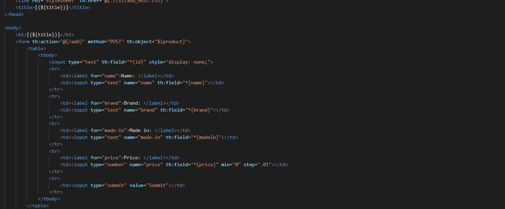
8. Sử dụng js để bắt sự kiện click reload lại trang với url tương ứng
- Hàm chạy ngay web dược khởi tạo
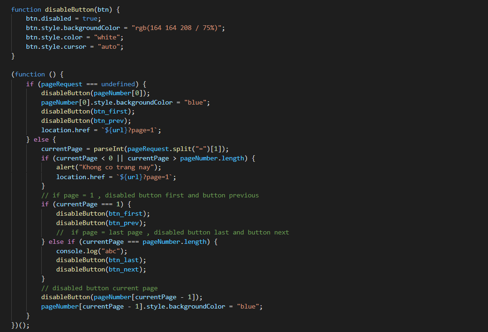
- Hàm xử lý di chuyển page
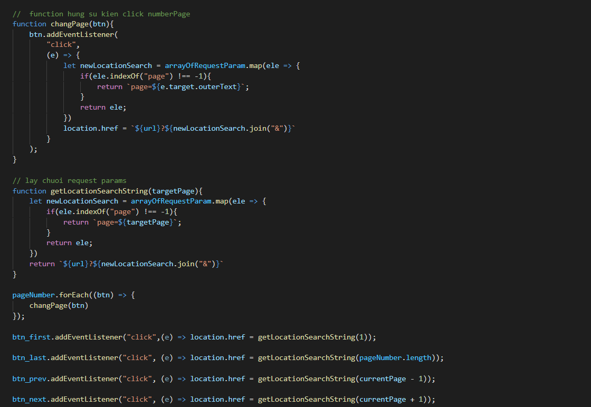
- Hàm xử lý sắp xếp khi click vào tên các trường trên màn hình danh sách product
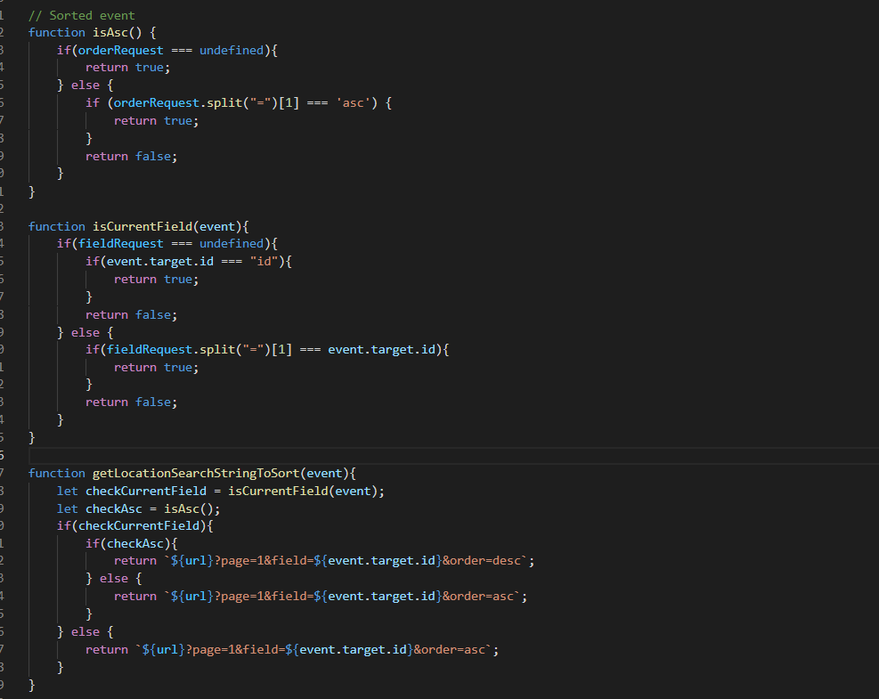
